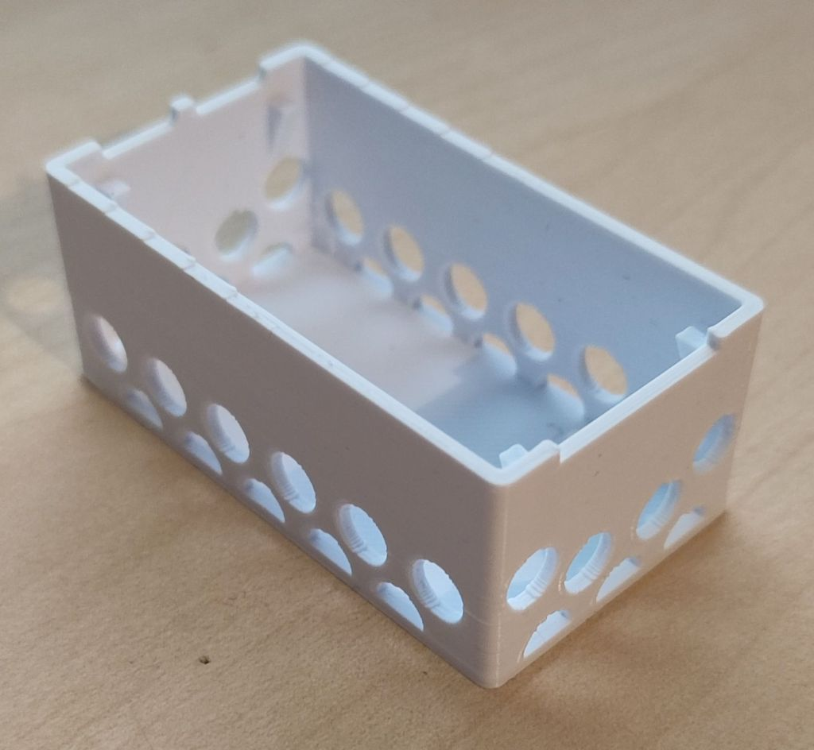
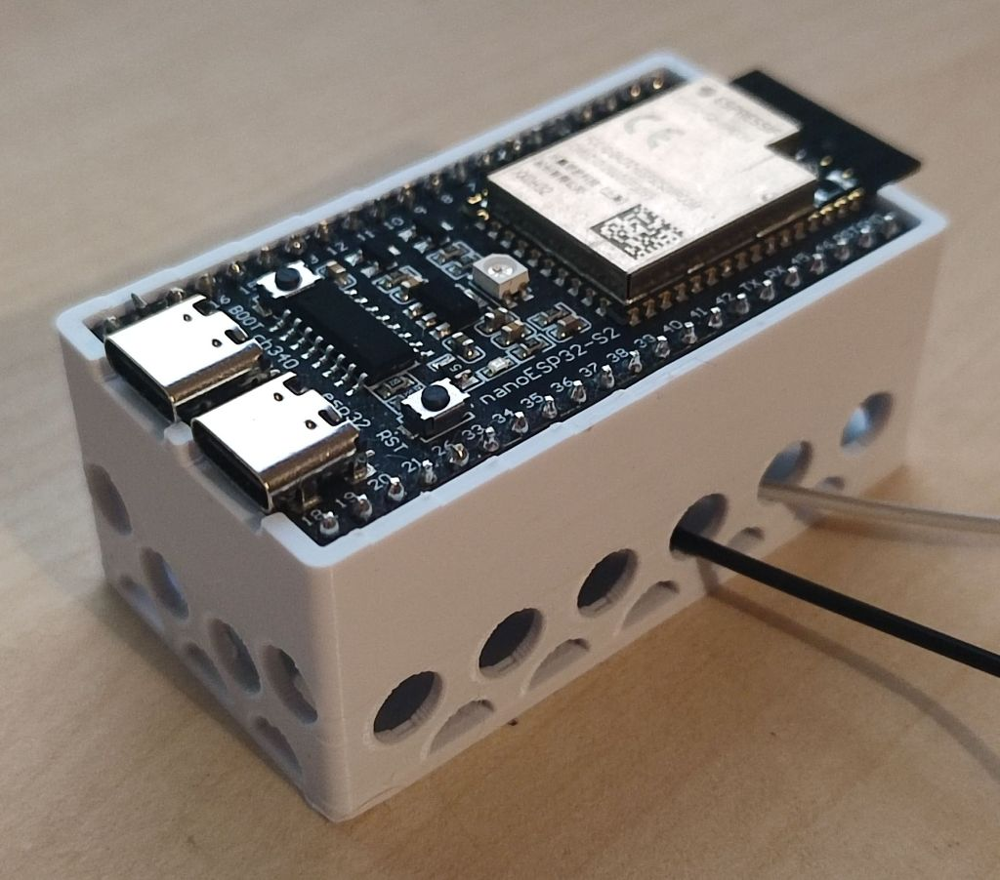
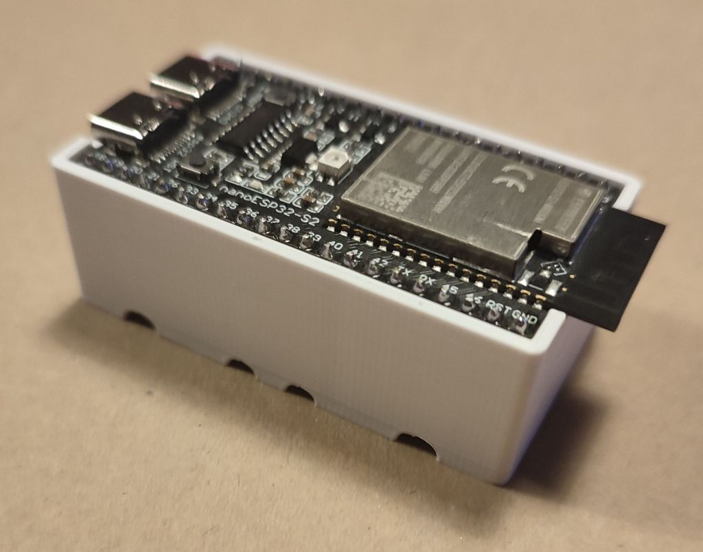
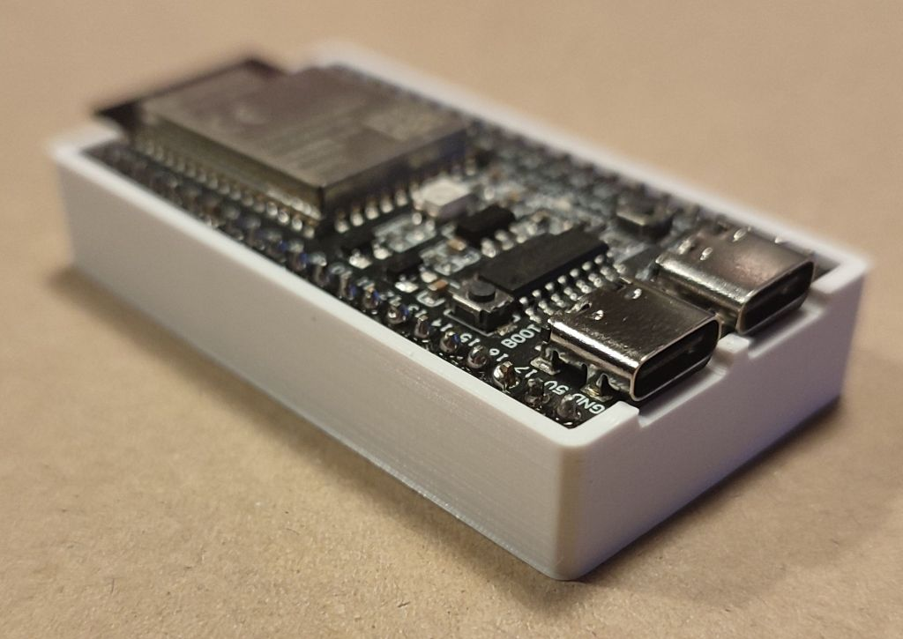

# 3D Printing - NanoESP32-S2 Holder
Small holder for the [NanoESP32-S2](https://github.com/wuxx/nanoESP32-S2) that allow you to easily run cable beneath the device without having it floating around and potentially shorting its pins on something on your desk or work area.

## Variants

### V3
Same model as V2 with more bigger holes, more vertical space and a bottom to close the insides.

[STL File](V3/Base_FixIt101.stl) *(Has some broken surfaces that mess up Prusaslicer badly)* 
[STL File](V3/Base_Raw.stl) *(Same as above, before using [FixIt 101](http://sketchucation.com/forums/viewtopic.php?f=323&t=58745))* 
[Sketchup File](V3/Base_FixIt101.skp) *(Requires Sketchup 2022 or newer)* 
[Sketchup File](V3/Base_Raw.skp) *(Same as above, before using [FixIt 101](http://sketchucation.com/forums/viewtopic.php?f=323&t=58745))* 

**Issues:** 
&nbsp;●&nbsp;&nbsp;The inter USB port corners are barely too wide. 
&nbsp;&nbsp;&nbsp;&nbsp;●&nbsp;&nbsp;<i>No negative effect.</i> 
&nbsp;&nbsp;&nbsp;&nbsp;●&nbsp;&nbsp;<i>Went from a 0.20mm to 0.19mm inter-port column.</i> 
&nbsp;&nbsp;&nbsp;&nbsp;●&nbsp;&nbsp;<i>Should be 0.175mm.</i> 
&nbsp;●&nbsp;&nbsp;The half circles at the bottom are too small. 
&nbsp;●&nbsp;&nbsp;Inner surfaces are even more messed up. 
&nbsp;&nbsp;&nbsp;&nbsp;●&nbsp;&nbsp;<i>Sketchup FTW...</i>

**Pictures:**
<table>
<tr>
<td><b>Empty holder</b></td>
<td><b>Holder with NanoESP32-S2 & Dupont cables sticking out.</b></td>
</tr><tr>
<td></td>
<td></td>
</tr>
</table>

### V2
Nearly perfect and usable version of the holder with a couple of small issues.

[STL File](V2/ESP32Holder_V2.stl) *(Has some broken surfaces that should be fine with slicers)* 
[Sketchup File](V2/ESP32Holder_V2.skp) *(Requires Sketchup 2022 or newer)* 

**Issues:** 
&nbsp;●&nbsp;&nbsp;The rounded USB port corners are to low. 
&nbsp;●&nbsp;&nbsp;The inter USB port corners are barely too wide. 
&nbsp;&nbsp;&nbsp;&nbsp;●&nbsp;&nbsp;<i>No negative effect due to previous issue.</i> 
&nbsp;&nbsp;&nbsp;&nbsp;●&nbsp;&nbsp;<i>Forgot to account for the PCB's thickness.</i> 
&nbsp;●&nbsp;&nbsp;Overall height should be 5mm taller to accommodate female Dupont cables better. 
&nbsp;&nbsp;&nbsp;&nbsp;●&nbsp;&nbsp;<i>Still works, but the turn is quite tight.</i> 
&nbsp;●&nbsp;&nbsp;Bottom support beams should be ~1mm thicker. 
&nbsp;●&nbsp;&nbsp;Side holes should be bigger and identical. 
&nbsp;●&nbsp;&nbsp;Final STL has errored surfaces inside the solid. 
&nbsp;&nbsp;&nbsp;&nbsp;●&nbsp;&nbsp;<i>Doesn't seem to affect slicer.</i> 
&nbsp;&nbsp;&nbsp;&nbsp;●&nbsp;&nbsp;<i>Gotta love Sketchup...</i>

**Pictures:**
<table>
<tr>
<td><b>Empty holder</b></td>
<td><b>Holder with NanoESP32-S2</b></td>
</tr><tr>
<td></td>
<td></td>
</tr>
</table>

<table>
<tr>
<td><b>USB's rounded corner issue</b></td>
</tr><tr>
<td>

</td>
</tr>
</table>

### V1
This version is a smaller version of the final holder originally used to test the fitting and check if the printer and filament didn't retract or expand too much.

**This version should only be used to test fitting !**

[STL File - Regular](V1/ESP32Holder.stl) *(Has some broken surfaces that should be fine with slicers)* 
[STL File - Thin Inside](V1/ESP32Holder_ThinInside.stl) *(Same as above & has shorted inner support columns)* 
[Sketchup File](V1/ESP32Holder.skp) *(Requires Sketchup 2022 or newer)* 

**Issues:** 
&nbsp;●&nbsp;&nbsp;The rounded USB port corners are to low. 
&nbsp;●&nbsp;&nbsp;The inter USB port corners are barely too wide. 
&nbsp;&nbsp;&nbsp;&nbsp;●&nbsp;&nbsp;<i>No negative effect due to previous issue.</i> 
&nbsp;&nbsp;&nbsp;&nbsp;●&nbsp;&nbsp;<i>Forgot to account for the PCB's thickness.</i> 
&nbsp;●&nbsp;&nbsp;Barely tall enough for pins to not stick out the bottom. 
&nbsp;●&nbsp;&nbsp;Final STL has errored surfaces inside the solid. 
&nbsp;&nbsp;&nbsp;&nbsp;●&nbsp;&nbsp;<i>Doesn't seem to affect slicer.</i>

**Pictures:**
<table>
<tr>
<td><b>Empty holder (Thin Inside version)</b></td>
<td><b>Holder with NanoESP32-S2</b></td>
</tr><tr>
<td></td>
<td></td>
</tr>
</table>

<table>
<tr>
<td><b>Pins sticking out (The angle exaggerates it quite a bit)</b></td>
</tr><tr>
<td>

</td>
</tr>
</table>

## Printing Settings
All prints shown in the pictures were made with the following parameters:

<table>
<tr>
<td><b>Parameter</b></td>
<td><b>V1</b></td>
<td><b>V2</b></td>
<td><b>V3</b></td>
</tr><tr>
<td>Printer</td>
<td colspan="3">Stock Creality Ender 3 Neo</td>
</tr><tr>
<td>Filament</td>
<td colspan="3">eSUN PLA+ White</td>
</tr><tr>
<td>Slicer</td>
<td colspan="2">Creality Slicer</td>
<td>Ultimaker Cura*</td>
</tr><tr>
<td>Temperatures</td>
<td colspan="3">215 °C Filament - 60 °C Bed</td>
</tr><tr>
<td>Layer height</td>
<td colspan="2">0.12mm**</td>
<td>0.20mm</td>
</tr><tr>
<td>Notes</td>
<td colspan="3">The infill used is not noted due to the fact there is basically none.</td>
</tr>
</table>

*: Tested Prusaslicer and the STL was too messed up for it. 
**: Should be fine with 0.16mm or 0.20mm if you thicken the supports on V2

## License
[Unlicense](LICENSE) (Public Domain)
