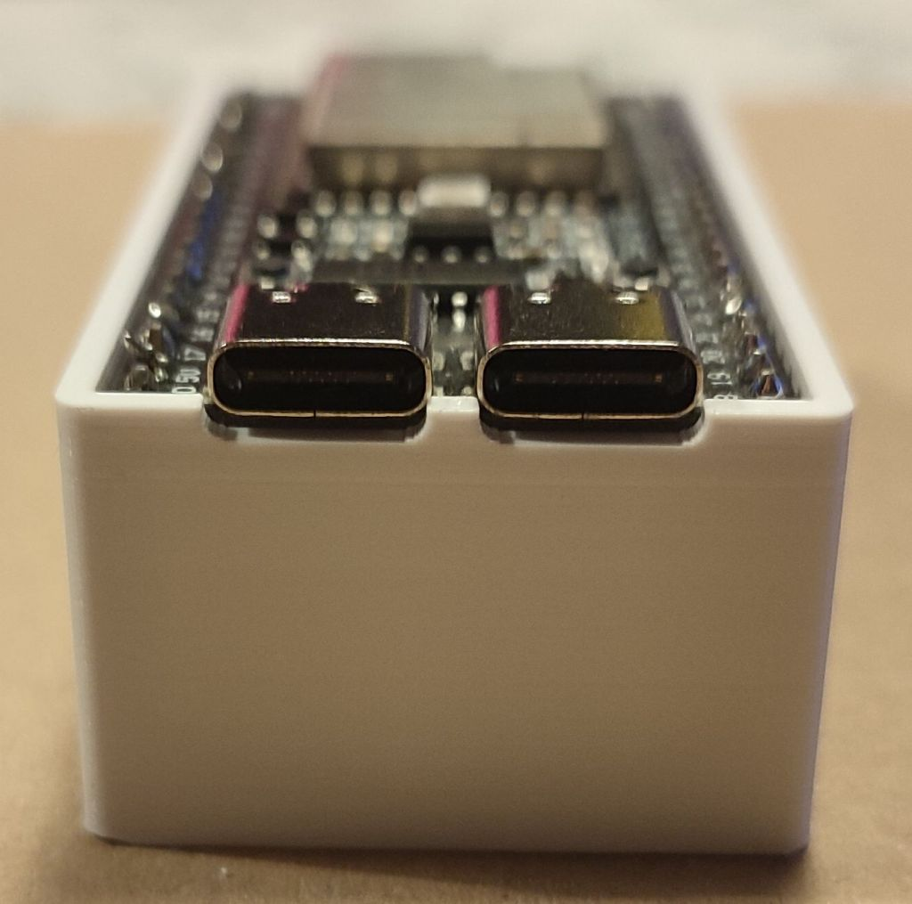

# 3D Printing - NanoESP32-S2 Holder
Small holder for the [NanoESP32-S2](https://github.com/wuxx/nanoESP32-S2) that allow you to easily run cable beneath the device without having it floating around and potentially shorting its pins on something on your desk or work area.

## Variants

### V3
*Should be coming at some point.*

### V2
Nearly perfect and usable version of the holder with a couple of small issues.

[STL File](V2/ESP32Holder_V2.stl) *(Has some broken surfaces that should be fine with slicers)* 
[Sketchup File](V2/ESP32Holder_V2.skp) *(Requires Sketchup 2022 or newer)* 

**Issues:** 
&nbsp;●&nbsp;&nbsp;The rounded USB port corners are to low. 
&nbsp;●&nbsp;&nbsp;The inter USB port corners are barely too wide. 
&nbsp;&nbsp;&nbsp;&nbsp;●&nbsp;&nbsp;<i>No negative effect due to previous issue.</i> 
&nbsp;&nbsp;&nbsp;&nbsp;●&nbsp;&nbsp;<i>Forgot to account for the PCB's thickness.</i> 
&nbsp;●&nbsp;&nbsp;Overall height should be 5mm taller to accomodate female dupont cables better. 
&nbsp;&nbsp;&nbsp;&nbsp;●&nbsp;&nbsp;<i>Still works, but the turn is quite tight.</i> 
&nbsp;●&nbsp;&nbsp;Bottom support beams should be ~1mm thicker. 
&nbsp;●&nbsp;&nbsp;Side holes should be bigger and identical. 
&nbsp;●&nbsp;&nbsp;Final STL has errored surfaces inside the solid. 
&nbsp;&nbsp;&nbsp;&nbsp;●&nbsp;&nbsp;<i>Doesn't seem to affect slicer.</i> 
&nbsp;&nbsp;&nbsp;&nbsp;●&nbsp;&nbsp;<i>Gotta love Sketchup...</i>

**Pictures:**
<table>
<tr>
<td><b>Empty holder</b></td>
<td><b>Holder with NanoESP32-S2</b></td>
</tr><tr>
<td></td>
<td></td>
</tr>
</table>

<table>
<tr>
<td><b>USB's rounded corner issue</b></td>
</tr><tr>
<td>

</td>
</tr>
</table>

### V1
This version is a smaller version of the final holder originally used to test the fitting and check if the printer and filament didn't retract or expand too much.

**This version should only be used to test fitting !**

[STL File - Regular](V1/ESP32Holder.stl) *(Has some broken surfaces that should be fine with slicers)* 
[STL File - Thin Inside](V1/ESP32Holder_ThinInside.stl) *(Same as above & has shorted inner support collumns)* 
[Sketchup File](V1/ESP32Holder.skp) *(Requires Sketchup 2022 or newer)* 

**Issues:** 
&nbsp;●&nbsp;&nbsp;The rounded USB port corners are to low. 
&nbsp;●&nbsp;&nbsp;The inter USB port corners are barely too wide. 
&nbsp;&nbsp;&nbsp;&nbsp;●&nbsp;&nbsp;<i>No negative effect due to previous issue.</i> 
&nbsp;&nbsp;&nbsp;&nbsp;●&nbsp;&nbsp;<i>Forgot to account for the PCB's thickness.</i> 
&nbsp;●&nbsp;&nbsp;Barely tall enough for pins to not stick out the bottom. 
&nbsp;●&nbsp;&nbsp;Final STL has errored surfaces inside the solid. 
&nbsp;&nbsp;&nbsp;&nbsp;●&nbsp;&nbsp;<i>Doesn't seem to affect slicer.</i>

**Pictures:**
<table>
<tr>
<td><b>Empty holder (Thin Inside version)</b></td>
<td><b>Holder with NanoESP32-S2</b></td>
</tr><tr>
<td></td>
<td></td>
</tr>
</table>

<table>
<tr>
<td><b>Pins sticking out (The angle exagerates it quite a bit)</b></td>
</tr><tr>
<td>

</td>
</tr>
</table>

## Remarks
All prints shown in the pictures were made with the following things: 
&nbsp;●&nbsp;&nbsp;Stock Creality Ender 3 Neo 
&nbsp;●&nbsp;&nbsp;eSUN PLA+ White 
&nbsp;●&nbsp;&nbsp;Creality Slicer with default settings 
&nbsp;●&nbsp;&nbsp;215 °C Filament - 60 °C Bed 
&nbsp;●&nbsp;&nbsp;0.12mm layer height 
&nbsp;&nbsp;&nbsp;&nbsp;●&nbsp;&nbsp;<i>Should be fine with 0.16mm or 0.20mm if you thicken the supports on V2</i> 
&nbsp;●&nbsp;&nbsp;20% Gyriod infill

## License
[Unlicense](LICENSE) (Public Domain)
